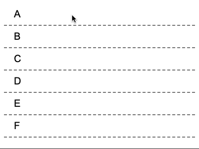

# React Dragged

Small React drag and sort component.



[**View Live Examples**](https://enijar.github.io/react-dragged/)

### Installation

```shell
npm add react-dragged
```

### Usage

**Basic Example**

```jsx
import React from "react";
import DragSort from "react-dragged";

function Example() {
  const [items, setItems] = React.useState([
    { title: "A" },
    { title: "B" },
    { title: "C" },
  ]);

  return (
    <DragSort
      items={items}
      onChange={setItems}
      renderItem={(item) => {
        return <div className="item">{item.title}</div>;
      }}
    />
  );
}
```

**TypeScript Example**

```typescript jsx
import React from "react";
import DragSort from "react-dragged";

type Item = {
  string: string;
};

function Example() {
  const [items, setItems] = React.useState<Item[]>([
    { title: "A" },
    { title: "B" },
    { title: "C" },
  ]);

  return (
    <DragSort<Item>
      items={items}
      onChange={setItems}
      renderItem={(item) => {
        return <div className="item">{item.title}</div>;
      }}
      renderContainerElement="ol"
      renderItemElement="li"
    />
  );
}
```

**Custom Elements**

```jsx
function Example() {
  const [items, setItems] = React.useState([
    { title: "A" },
    { title: "B" },
    { title: "C" },
  ]);

  return (
    <DragSort
      items={items}
      onChange={setItems}
      renderItem={(item) => {
        return <div className="item">{item.title}</div>;
      }}
    />
  );
}
```

### Why?

Whilst there are many drag and drop libs out in the wild, none of the ones I've used have been particularly easy to use. Most either required a lot of boilerplate or are very old and no longer maintained.

This lib only supports drag sort functionality. Under the hood it's using the HTML5 drag and drop API with logic to make sure the `DragSort` component doesn't render more than it needs to.

This lib also inverts the control of the items, meaning you are in control of the items state. Internally this lib keeps track of the items order with some refs, meaning there is only one render when the items array changes.

### Contributing

```shell
npm install
npm start
```
